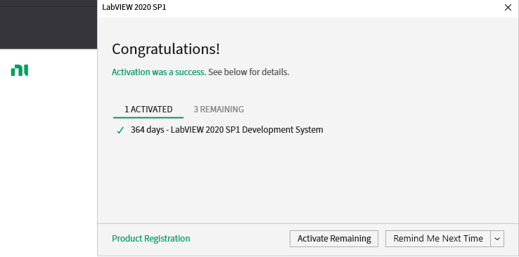

This is a nodejs based docsified repo.  
This is to be deployed to GitHub Pages.

# N年来第一次用上了正版的NI Labview

见下图，激活成功  

这里要吐槽一下，既然是社区版，为什么还要激活呢？   
人家Visual Studio Community怎么不需要激活呢？   
是真心诚意的搞社区版吗？还只有1年有效期。   
再者，国内的家宽就是差啊，输了好几次账号秘密，终于激活成功。   
话说这个NI账户还是N久之前，在NANO的时候搞自动化程序开发的时候申请的。   
NI和Labview为什么就那么多人喜欢用呢？我就纳闷了，   
